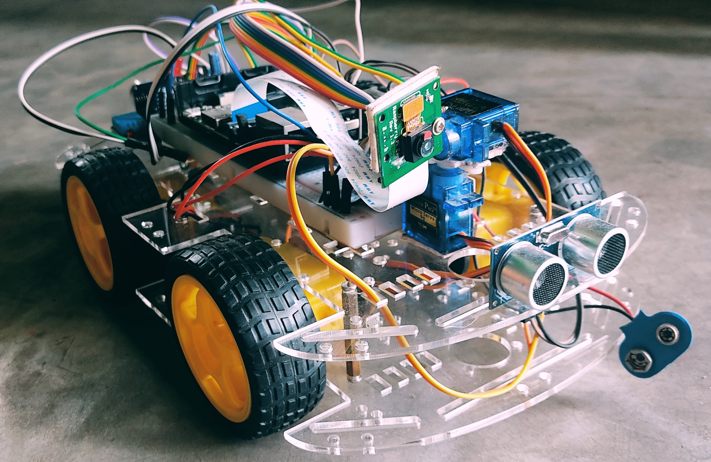
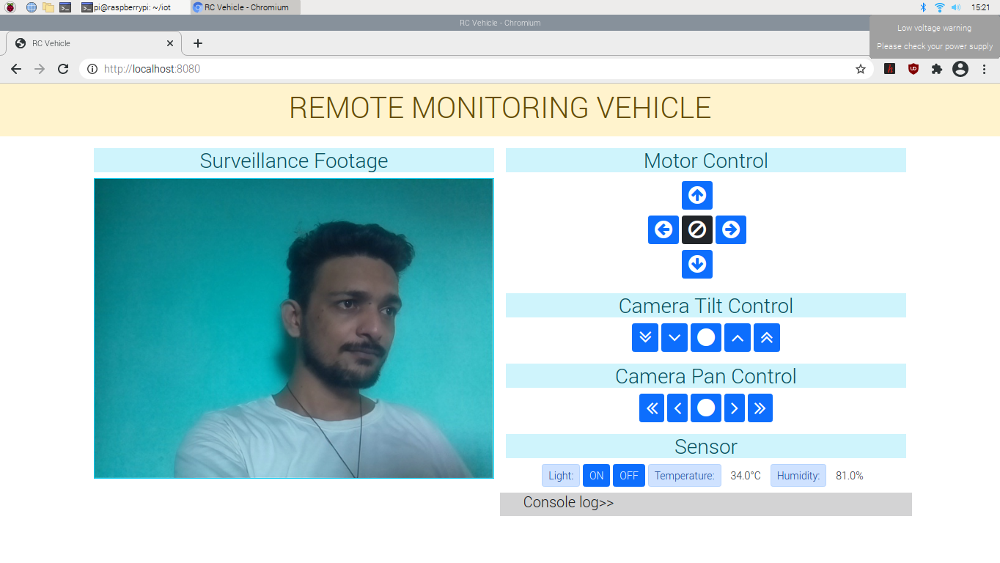

# Remote-Monitoring-Vehicle

 <br>

### Dependencies

<ul>
    <li> 
        <a href="https://www.djangoproject.com/" >Django</a>
    </li>
    <li>
        <a href="https://opencv.org/" >OpenCV</a>
    </li>
    <li>
        <a href="https://gpiozero.readthedocs.io/" >gpiozero</a>
    </li>
    <li>
        <a href="https://pypi.org/project/RPi.GPIO/" >RPi.GPIO</a>
    </li>
    <li>
        <a href="https://learn.adafruit.com/dht-humidity-sensing-on-raspberry-pi-with-gdocs-logging/python-setup/" >Adafruit_DHT</a>
    </li>
</ul>

To run the server
```
    $ python3 manage.py runserver 0.0.0.0:8080
```
To run app in browser
```
    http://localhost:8080/
```

#### Result

 <br>

